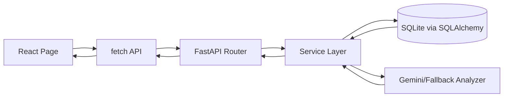
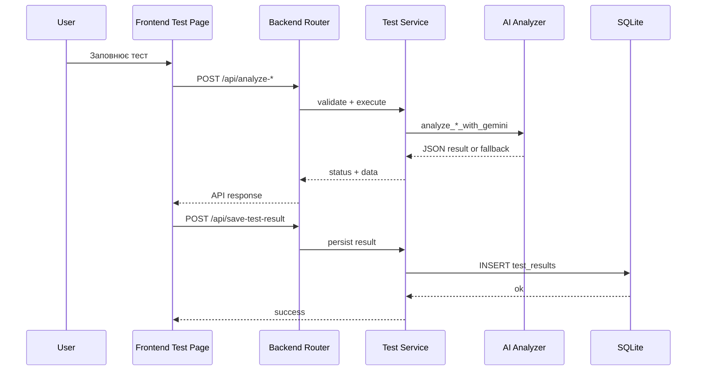

# Psy-AI

Psy-AI це повностек-платформа для психологічного тестування, AI-аналізу та комунікації між клієнтом і фахівцем.

## 1. Швидкий Старт

### Backend (FastAPI)

```bash
python3 -m app.api
```

Сервер стартує на `http://localhost:8000`.

### Frontend (Vite + React)

```bash
cd frontend
npm install
npm run dev
```

Frontend стартує на `http://localhost:5173`.

### Налаштування API URL на фронті

- Файл: `frontend/src/lib/config/api.js`
- Логіка: бере `VITE_API_BASE_URL`, і якщо змінна не задана, використовує `http://localhost:8000`.

## 2. Повна Архітектурна Схема

### 2.1 Backend шари

```text
app/
	api.py                       # композиція застосунку, CORS, підключення роутерів
	main.py                      # thin entrypoint

	core/
		settings.py                # константи застосунку
		database.py                # SQLAlchemy engine, Base, ORM моделі, get_db
		auth.py                    # хешування паролів, JWT
		ai_analyzer.py             # інтеграція Gemini + fallback логіка
		metrics.py                 # tononi_complexity, free_energy

	schemas/                     # Pydantic DTO для API контрактів
		auth.py
		users.py
		chat.py
		tests.py

	services/                    # бізнес-логіка (без HTTP-шару)
		auth_service.py
		user_service.py
		chat_service.py
		test_service.py

	routers/                     # HTTP-шар (APIRouter)
		auth.py
		users.py
		chat.py
		tests.py

	lexicons/                    # психологічні словники
	models/                      # доменні моделі аналізатора
	utils/                       # утиліти обробки тексту
```

### 2.2 Frontend шари

```text
frontend/src/
	App.jsx                      # роутинг сторінок
	main.jsx                     # точка входу React

	components/
		layout/                    # глобальні каркасні компоненти
			Header.jsx
			Footer.jsx
		common/                    # повторно використовувані блоки
			ResultsDisplay.jsx
			TestCard.jsx

	pages/
		home/
		auth/
		dashboard/
		tests/
		chat/
		profile/
		specialists/

	lib/
		config/
			api.js                   # API_BASE_URL
		data/
			sachsLevy.js             # питання та ключі тесту
			mockData.js              # dev-дані
```

### 2.3 Потік запиту (загальний)



### 2.4 Потік аналізу тесту



## 3. API Мапа (поточний контракт)

### Auth
- `POST /api/register`
- `POST /api/login`

### Users / Specialists
- `GET /api/user/{user_id}`
- `GET /api/psychologists`
- `POST /api/assign-psychologist`
- `GET /api/my-psychologist/{email}`
- `GET /api/my-patients/{email}`

### Chat
- `POST /api/messages`
- `GET /api/messages/{user1_id}/{user2_id}`
- `GET /api/presence/{user_id}`

### Tests / AI
- `POST /api/analyze-interview`
- `POST /api/analyze-sachs`
- `POST /api/analyze-beck`
- `POST /api/save-test-result`
- `GET /api/test-results/{user_id}`

## 4. Модель Даних (SQLite)

### Таблиці
- `users`
	- `id`, `full_name`, `age`, `phone`, `email`, `hashed_password`, `role`, `psychologist_id`
- `test_results`
	- `id`, `user_id`, `test_type`, `ai_response`, `created_at`
- `messages`
	- `id`, `sender_id`, `receiver_id`, `text`, `timestamp`

## 5. Сумісність Після Рефактору

Збережено backward compatibility для старих імпортів із `app.api`, включно з:
- `SachSentence`
- `SachsTestPayload`
- `InterviewPayload`
- `BeckPayload`
- `TestResultCreate`
- `analyze_sachs_test`
- `analyze_beck`
- `analyze_interview`

Це дозволяє старим скриптам і тестам працювати без зміни імпортів.

## 6. Де Що Міняти

- Додати новий endpoint: створити схему в `app/schemas`, сервіс у `app/services`, маршрут у `app/routers`, підключити в `app/api.py`.
- Змінити бізнес-логіку авторизації: `app/services/auth_service.py`.
- Змінити логіку чату/online: `app/services/chat_service.py`.
- Змінити AI pipeline: `app/services/test_service.py` та `app/core/ai_analyzer.py`.
- Додати нову сторінку frontend: покласти у відповідну feature-папку в `frontend/src/pages` та прописати маршрут у `frontend/src/App.jsx`.

## 7. Тести

Поточний базовий тест:
- `tests/test_basic.py`

Запуск:

```bash
pytest -q
```
